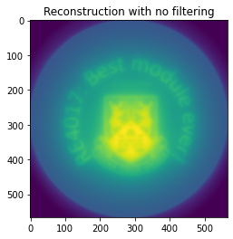
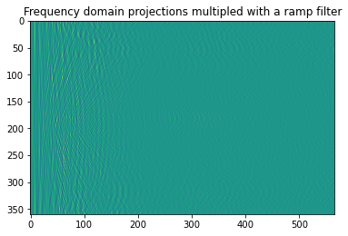
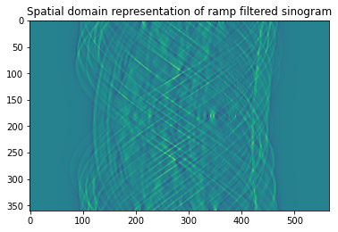
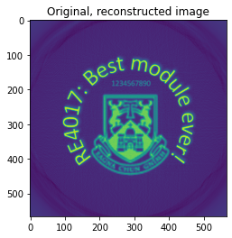

# SinogramReconstruction

이 프로젝트는 제조업 결함 탐지를 위한 시노그램(Sinogram)에서 이미지를 재구성하는 코드입니다. 필터링된 역투영(Filtered Back-Projection) 방법을 사용하여 시노그램을 원래 이미지로 복원합니다.

## 결과 이미지

### 시노그램 및 재구성 과정


### 필터링된 이미지 재구성 결과


### 진폭 스펙트럼 및 필터링 과정


### 해밍 윈도우 적용 결과


## 개요

이 코드는 다음과 같은 주요 기능을 제공합니다:

1. 시노그램 이미지로부터 원본 이미지 복원
2. 라돈 변환(Radon Transform)을 사용한 시노그램 생성
3. 필터링된 역투영(Filtered Back-Projection) 알고리즘 구현
4. 해밍 윈도우(Hamming Window)를 적용한 이미지 개선

## 주요 함수

- `radon(image, steps)`: 이미지를 시노그램으로 변환
- `fft_translate(projs)`: 시노그램을 주파수 도메인으로 변환
- `ramp_filter(ffts)`: 1차원 FFT에 램프 필터 적용
- `inverse_fft_translate(operator)`: 1차원 역 FFT 적용
- `back_project(operator)`: 역투영을 통한 이미지 재구성

## 이미지 재구성 과정

1. 시노그램 로딩
2. 필터링 없는 백프로젝션 복원 (비교용)
3. 시노그램의 1차원 진폭 스펙트럼 계산
4. 램프 필터링된 1차원 진폭 스펙트럼 계산
5. 1차원 역푸리에변환 수행
6. 백프로젝션 복원 수행
7. 해밍윈도우 적용한 개선된 복원 이미지 생성

## 필요한 라이브러리

- NumPy
- imutils
- scikit-image
- SciPy
- matplotlib
- imageio

## 설치 방법

```bash
# 저장소 클론
git clone https://github.com/bemoregt/SinogramReconstruction.git
cd SinogramReconstruction

# 필요한 패키지 설치
pip install -r requirements.txt
```

## 사용 방법

### 1. 샘플 시노그램 생성

테스트용 시노그램을 생성하려면 다음 명령어를 실행합니다:

```bash
python generate_sample_sinogram.py
```

이 스크립트는 Shepp-Logan 팬텀 이미지를 생성하고, 이를 이용해 시노그램을 생성한 후 'sinog.png' 파일로 저장합니다.

### 2. 이미지 복원

생성된 시노그램 또는 사용자의 시노그램을 이용해 이미지를 복원하려면:

```bash
python sinogram_reconstruction.py
```

이 스크립트는 다음 세 가지 결과 이미지를 생성합니다:
- `reconstructed_no_filter.png`: 필터링 없이 복원된 이미지
- `reconstructed_with_filter.png`: 램프 필터링을 적용하여 복원된 이미지
- `reconstructed_with_hamming.png`: 해밍 윈도우를 추가로 적용한 이미지

## 결과 설명

코드 실행 시 다음과 같은 이미지들이 순차적으로 표시됩니다:
- 원본 시노그램: 다양한 각도에서 촬영된 투영 이미지들을 모은 것
- 필터링 없는 백프로젝션 복원 이미지: 블러링이 심하게 발생
- 시노그램의 주파수 도메인 표현: 푸리에 변환을 통한 주파수 분석
- 램프 필터링된 주파수 도메인: 고주파를 강조하여 선명도를 높임
- 램프 필터링된 시노그램의 공간 도메인 표현: 역푸리에 변환 결과
- 최종 복원된 이미지: 필터링된 역투영을 통해 복원된 선명한 이미지
- 해밍윈도우 적용 복원 이미지: 노이즈를 감소시킨 최종 결과물

## 참고 자료

이 코드는 다음 저장소를 참고하였습니다:
- [Sinogram-to-Image](https://github.com/IanB14/Sinogram-to-Image)

## 용도

이 코드는 다음과 같은 분야에 활용될 수 있습니다:
- 산업용 CT 스캔에서 결함 탐지
- 비파괴 검사(NDT) 시스템
- 의료 이미지 처리
- 제조업 품질 관리

## 라이센스

MIT 라이센스